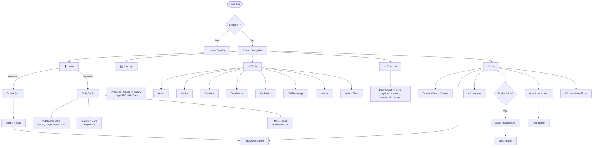

# L. Glow — App Map

Two views of the same app: a structure diagram for navigation, and status tables for tracking what's built, what's drafted, and what's still needed.

**Status key**
| Symbol | Meaning |
|--------|---------|
| ✅ | Built and content approved — ships as-is |
| 🟡 | Built, content is DRAFT — Thea to review before launch |
| 🔜 | Screen built, content empty — needs Thea's voice memo |
| 🚧 | Scaffold only — structure exists, questions/copy need Thea's rewrite before users see it |
| 📋 | Planned, not yet built |

---

## Navigation Map

---

## Screen Inventory

### Home Tab

| Screen | Status | Notes |
|--------|--------|-------|
| Home screen | ✅ | Returning-user and new-user states |
| Mythbuster card | ✅ | Agni edition loaded — 12 myths, weekly drip Aug 17–Nov 2 |
| Intention card | 🟡 | Structure live; Vata/Pitta/Kapha suggestion pools empty — Thea to fill |
| Music card | 🔜 | Spotify link-out built; Thea to curate playlists and choose org (by dosha? season?) |

### Tools Tab

| Screen | Status | Notes |
|--------|--------|-------|
| Learn | ✅ | Table of contents + detail views built; content varies — see Content table below |
| Herbs | 🔜 | Screen built with draft data; superseded by full A–Z database Thea produced (item 36, not yet loaded) |
| Recipes | 📋 | Route exists, content empty — Thea to author |
| Breathwork | 📋 | Route exists, content empty — Thea to author |
| Meditation | 📋 | Route exists, content empty — Thea to author |
| Self Massage | 📋 | Route exists, content empty — Thea to author |
| Journal | ✅ | Free-form dated entries, stored locally |
| About Thea | ✅ | Bio, credentials, "Book a session" CTA stub, Instagram feed (needs token — see item 10a) |

### Check In Tab

| Screen | Status | Notes |
|--------|--------|-------|
| Daily check-in | ✅ | physical / mental / emotional / hunger sliders, note field |
| Morning + evening check-ins | 📋 | Two check-ins per day planned — question sets need Thea's input first (#19, #26) |

### You Tab

| Screen | Status | Notes |
|--------|--------|-------|
| Dosha wheel + scores | ✅ | SVG donut + three-percentage breakdown |
| Today's Guidance (Recommendations) | ✅ | Dosha-tuned food, movement, herbs, lifestyle |
| Affirmations | 🟡 | 13 entries live; dosha-specific pools thin — Thea to expand |
| Guna Assessment | 🟡 | Quiz + result built; 15 questions from Thea (t16); result copy DRAFT (t18) |
| Agni Assessment | 🚧 | Quiz + result built; questions are structural scaffold — Thea must rewrite all 8 before users see this |
| Clinical Intake Form | ✅ | Prakriti constitution section built |

### Auth

| Screen | Status | Notes |
|--------|--------|-------|
| Login | ✅ | Email/password + magic link (passwordless) |
| Sign Up | ✅ | Firebase Auth, session persistence |

### Dosha Quiz Flow

| Screen | Status | Notes |
|--------|--------|-------|
| Dosha Quiz | 🟡 | Current question set is a scaffold — full redesign planned (item 18, draft in quiz-draft.js) |
| Dosha Result | 🟡 | Result copy + archetypes DRAFT (t19) — The Wanderer / The Warrior / The Keeper |

---

## Content Status

### Learn Module

| Entry | Tier | Status | Source |
|-------|------|--------|--------|
| What Is Ayurveda? | 1 | 🟡 DRAFT | Transcript 20 |
| The Five Elements | 1 | 🟡 DRAFT | Transcript 26 |
| The Doshas | 1 | 🟡 DRAFT | May 2026 voice memo |
| Prakriti & Vikriti | 1 | 🟡 DRAFT | May 2026 voice memo |
| Agni — Digestive Fire | 1 | 🟡 DRAFT | Transcript 21 (expanded) |
| Ama — Toxic Accumulation | 1 | 🟡 DRAFT | April 2026 voice memo |
| Food as Medicine | 1 | 🟡 DRAFT | Transcript 22 |
| The Six Tastes (Shad Rasa) | 2 | 🔜 Empty | Needs voice memo |
| Qualities of Matter (Gunas) | 2 | 🟡 DRAFT | Transcript 16 |
| Qualities of Mind (Sattva/Rajas/Tamas) | 2 | 🟡 DRAFT | Transcript 15 |
| Cultivating Sattva | 2 | 🟡 DRAFT | Memos 07–08 |
| Vital Essence (Ojas/Tejas/Prana) | 2 | 🟡 DRAFT | Memo 09 |
| Daily & Seasonal Rhythms (Dinacharya) | 2 | 🔜 Empty | Needs voice memo |
| The Seven Tissues (Sapta Dhatus) | 3 | 🔜 Empty | Thea's call whether Tier 3 belongs in a consumer app |
| The Three Waste Products (Tri Malas) | 3 | 🔜 Empty | Thea's call |
| The Channel Systems (Srotas) | 3 | 🔜 Empty | Thea's call |

### Mythbusters

| Edition | Status | Notes |
|---------|--------|-------|
| Agni Edition (12 myths) | ✅ | Weekly drip Aug 17–Nov 2, 2026. Reframe lines distilled from Thea's text — she should review those 12 lines. |
| General Edition (9 myths) | 🚧 | Content authored, richer schema needed before loading. Data structure decision needed (dosha breakdowns per myth?). |
| Food Guide | 🚧 | Content authored but incomplete — cuts off mid-sentence. Thea to supply the rest. |

### Assessments

| Assessment | Questions | Result Copy | Notes |
|------------|-----------|-------------|-------|
| Dosha Quiz | 🟡 Scaffold | 🟡 DRAFT | Full redesign planned (quiz-draft.js) |
| Guna Assessment | ✅ Thea's | 🟡 DRAFT | 15 questions from t16; result from t18 |
| Agni Assessment | 🚧 Scaffold | 🟡 DRAFT | **Questions must be rewritten by Thea before launch.** 4 closing notes (lGlowNote) also needed. |

### Other Content

| Content | Status | Notes |
|---------|--------|-------|
| Dosha archetypes | 🟡 DRAFT | The Wanderer / The Warrior / The Keeper (t19) |
| Affirmations pool | 🟡 Thin | 13 entries; universal + archetype reminders. Dosha-specific pools need expansion. |
| Movement / Asana | 🔜 Empty | Scaffold built; posture descriptions + benefit copy needed per dosha |
| Daily routine suggestions | 📋 Not built | Dosha-tuned daily rhythms (wake before 6, etc.) — content + screen needed |
| Evening / sleep guidance | 📋 Not built | Janitor metaphor, 10pm–2am window — voice memo needed |
| Herb + Food Database | 📋 Not built | A–Z database complete (docx); data structure + build needed (item 36) |
| Vata/Pitta/Kapha food lists | 🚧 Ready to load | Transcripts 23–25. Waiting on data structure decision (item 36) before loading. |
| Voice guide | 🟡 v0.3 | Awaiting Thea's approval. Welcome screen + check-in copy can't update until v0.4 is signed off. |

---

## Open Decisions for Thea

Quick reference — full detail in the [open items summary](../docs/open-items-thea.md) or the roadmap.

| # | Decision | Urgency |
|---|----------|---------|
| 1 | **Agni quiz questions** — rewrite all 8 before quiz ships | 🔴 High — blocks feature launch |
| 2 | **Voice guide v0.4** — approve or revise | 🔴 High — blocks welcome + check-in copy |
| 3 | **Mythbusters: full edition screen?** — Option A (drip) is live; B/C need new screen | 🟡 Medium |
| 4 | **General mythbusters schema** — dosha breakdowns per myth or simplified? | 🟡 Medium |
| 5 | **Food guide completion** — content cuts off, send the rest | 🟡 Medium |
| 6 | **Dosha quiz redesign** — replace current quiz or run alongside? | 🟡 Medium |
| 7 | **Morning/evening check-in questions** — define what each check-in asks | 🟡 Medium |
| 8 | **Music playlists** — how to organize: dosha / season / energetic state? | 🟡 Medium |
| 9 | **"Goals" framing in You tab** — what to call this section | 🟡 Medium |
| 10 | **Instagram setup** — Creator account + token (steps in roadmap item 10a) | 🟡 Medium |
| 11 | **Tier 3 Learn entries** — do Sapta Dhatus, Tri Malas, Srotas belong in a consumer app? | 🟢 Low |
| 12 | **Agni mythbuster reframes** — 12 one-line reframes distilled from her text; she should read and adjust | 🟢 Low |
